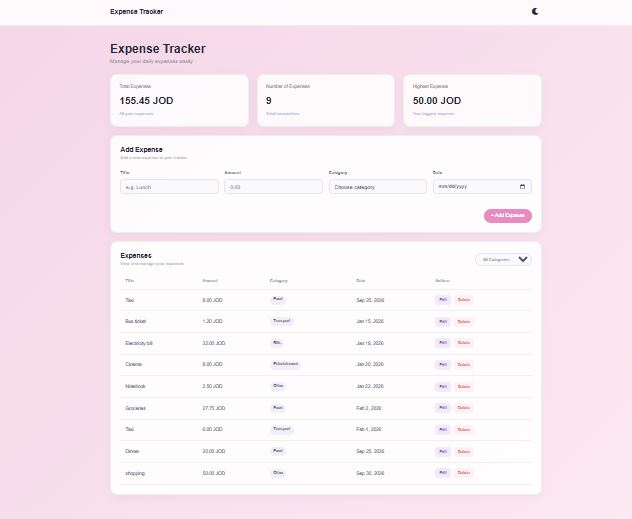
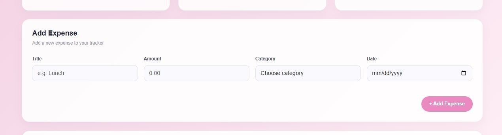
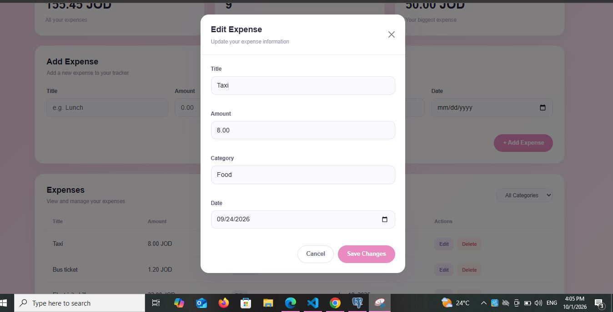

# Expense Tracker

Expense Tracker is a simple web application for managing daily expenses.
Users can add, edit, delete, and filter expenses, while the application displays summary information such as the total expenses, number of expenses, and highest expense.

## How to run

### Backend

1. Open the project in VS Code.

2. Open PostgreSQL / pgAdmin and create a database named:

```text
expense_tracker_practice
```

3. Open the `schema.sql` file and run it inside the `tracker_expense` database to create the `expenses` table.

4. Open the `backend` folder in the terminal:

```bash
cd backend
```

5. Install the required packages:

```bash
npm install
```

6. Create a `.env` file inside the `backend` folder and add:

```env
DB_HOST=localhost
DB_PORT=5432
DB_USER=postgres
DB_PASSWORD=YOUR_PASSWORD
DB_NAME=tracker_expense
```

Replace `YOUR_PASSWORD` with your PostgreSQL password.

7. Start the backend server:

```bash
npm start
```

The backend should run on:

```text
http://localhost:3000
```

### Frontend

1. Open the `frontend` folder.

2. Open `index.html` using Live Server in VS Code.

3. The Expense Tracker application will open in the browser.

4. The frontend connects to the backend API:

```text
http://localhost:3000/api/expenses
```

## Features

* [x] Add an expense (with validation)
* [x] Delete an expense
* [x] Edit an expense
* [x] Filter by category
* [x] Summary cards (total, count, highest)
* [x] Data is saved in a PostgreSQL database

## Screenshots

### Desktop

Add a screenshot of the desktop version here.



### Add / Edit Expense

Add a screenshot of the Add Expense form or Edit Expense modal here.




### Mobile

Add a screenshot of the responsive mobile version here.

![Expense Tracker Mobile]
(screenshots/phone.JPG)

## What was the hardest part?

The hardest part was connecting the frontend with the backend API and PostgreSQL database. I also faced a CORS error when the frontend tried to communicate with the backend.


## Link video


https://drive.google.com/drive/folders/1mdRKKNR-ZQlMRGPVtwDiYJ1aOuEYo5ee


## linl the github
https://github.com/baraaalmeqbel/expense-tracker